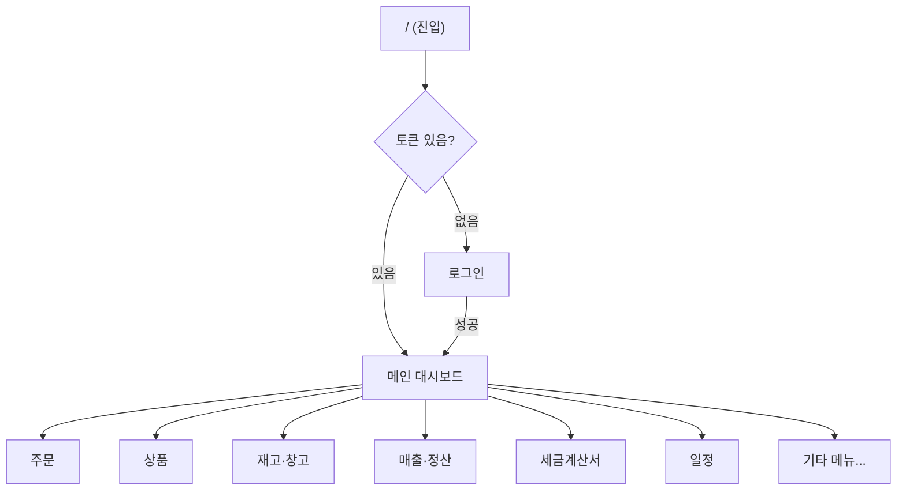
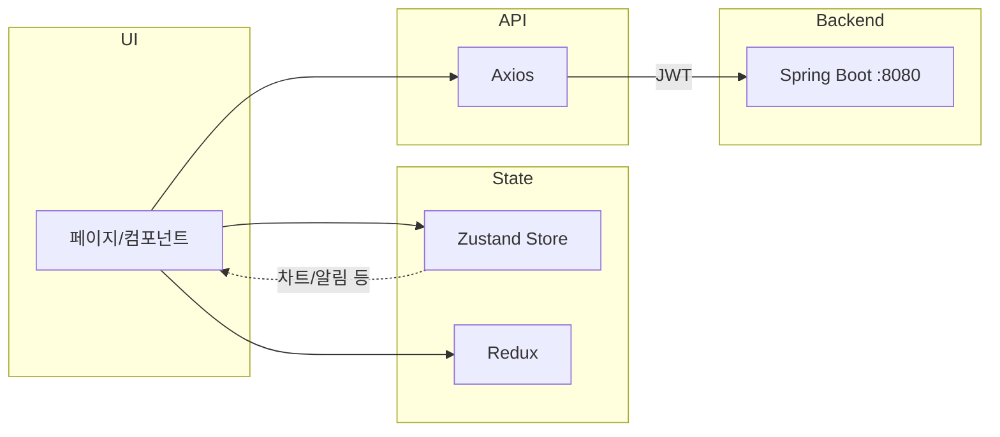

# Junko — Frontend

> 주문·재고·매출·세금계산서·일정을 한 화면에서 관리하는 ERP 대시보드

---

## 한눈에 보기

| 구분 | 내용 |
|------|------|
| **역할** | 로그인, 대시보드, 주문/재고/매출/일정 등 전체 UI |
| **기술 스택** | Next.js 15, React 19, MUI 7 |
| **상태 관리** | Zustand, Redux Toolkit |
| **실행** | `npm run dev` → http://localhost:3000 |

---

## 기술 스택

| 분류 | 기술 |
|------|------|
| **Framework** | Next.js 15 (App Router), React 19 |
| **UI** | MUI 7, Emotion, Headless UI, react-icons |
| **상태** | Zustand, Redux Toolkit |
| **데이터·통신** | Axios |
| **차트·일정** | Chart.js, Recharts, react-big-calendar |
| **기타** | dayjs, date-fns, react-datepicker, react-pdf, DnD(@dnd-kit), pagination |

---

## 아키텍처

**앱 흐름**



**데이터·상태 흐름**



---

## 주요 화면 (기능)

| 메뉴 | 설명 |
|------|------|
| **대시보드** | 월/일 매출 차트, 입출고 차트, 인기 상품, 일정 요약 |
| **주문** | 주문 목록·등록·상세 |
| **상품** | 상품 CRUD, 옵션, CSV 일괄 등록, 문서 첨부 |
| **재고·창고** | 재고 조회, 재고 조정·이력, 창고 관리 |
| **입고·출고** | 입고, 출고, 반품, 배송, 송장 |
| **매출·정산** | 매출, 매입정산, 수입·지출, 전표 |
| **세금계산서** | 세금계산서 목록·상세·PDF |
| **전표·템플릿** | 전표(입금/지출), 템플릿 CRUD |
| **일정** | 캘린더(개인/부서/업무), 일정 CRUD |
| **근태** | 출퇴근 기록 |
| **기타** | PDF 뷰어, 공통 모달(알림/날짜/검색 등) |

---

## 프로젝트 구조

```
frontend/
├── src/app/
│   ├── page.jsx              # 진입: 로그인 or 메인
│   ├── layout.jsx, header.jsx, globals.css
│   ├── zustand/store.jsx     # 전역 상태
│   ├── component/
│   │   ├── login, mainPage
│   │   ├── order, product, stock, warehouse, shipment, receive, return
│   │   ├── sales, purchaseSettlement, receiptPayment, taxInvoice
│   │   ├── voucher, template, schedule, timecard
│   │   ├── modal/            # 공통 모달
│   │   └── utills/
│   └── ...
├── package.json
└── README.md
```

---

## 실행 방법

**요구사항:** Node.js 18+, npm

1. **의존성 설치**
   ```bash
   cd frontend
   npm install
   ```

2. **개발 서버**
   ```bash
   npm run dev
   ```
   → **http://localhost:3000**

3. **빌드·프로덕션**
   ```bash
   npm run build
   npm start
   ```

---

## 백엔드 연동

- API Base: `http://localhost:8080` (필요 시 환경 변수로 분리)
- 로그인 후 발급된 JWT를 `sessionStorage`에 저장하고, 요청 시 `Authorization` 헤더로 전달

---

*Junko 프로젝트 — Frontend*
